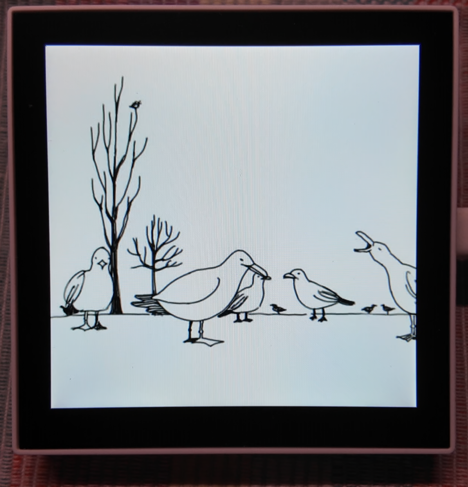

ESP32-Media-Imu-demo

&emsp;基于waveshare ESP32-S3 Smart 86 BOX 的音频+视频播放项目，使用6轴 IMU 实现控制播放逻辑的演示 
&emsp; 

&emsp;Demo Video1&2: 

 

Video link: https://github.com/Kaswish/ESP32-Media-Imu-Demo/issues/1

Video link:
(https://github.com/Kaswish/ESP32-Media-Imu-Demo/issues/1)

 

功能 
&emsp;使用 QMI8658 检测盒子是否被拿起; 
&emsp;&emsp;拿起状态下: 
    &emsp;&emsp;&emsp;循环播放 mjpeg(480*480,10fps) + WAV(16-bit PCM, MONO);  
&emsp;&emsp;平放状态: 
    &emsp;&emsp;&emsp;暂停播放，显示雪花屏; 

硬件清单 
&emsp;ESP32-S3-Touch-LCD-4B  https://www.waveshare.com/wiki/ESP32-S3-Touch-LCD-4B#Resources

软件依赖: 
&emsp;-LillteFS 
&emsp;-GFX Library for Arduino 
&emsp;-JPEGDEC 
&emsp;-SensorLib 

